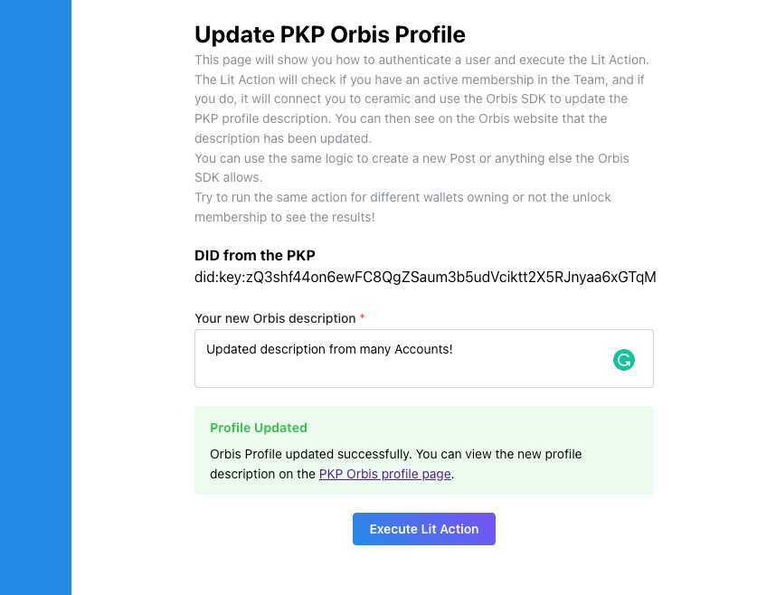
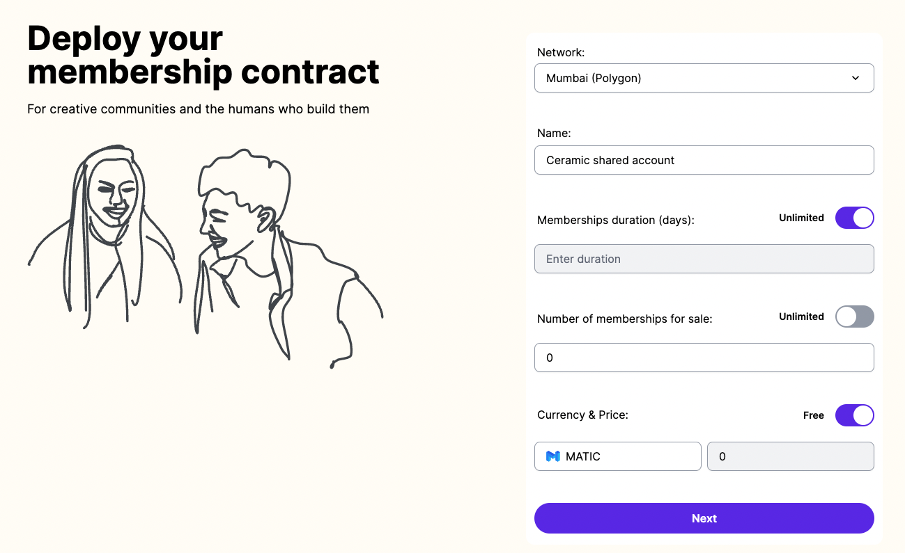

# Ceramic multi users

_This project was created as part of the [The Web3 Social Hackathon](https://orbis.club/web3-social-hackathon-dec-2022)._

It provides a solution for allowing multiple wallets to write on the same ceramic stream via [Lit Actions](https://developer.litprotocol.com/SDK/Explanation/litActions) and [Unlock protocol](https://docs.unlock-protocol.com/).

_Note: the code is configured to work with the Mumbai (Polygon) network._

## Features

- Allow multiple ETH wallets to update the same ceramic stream
- Team membership represented as an NFT via Unlock Protocol
- Add/remove members from the team
- Role based system (admin, editor), only admins can add/remove editors
- Authenticate with the Orbis SDK to create posts, update profile etc..

## Why this project?

Ceramic only allows one user to own and update a stream. This can be a problem for applications that need multiplayer capabilities. So if you want to share an account between multiple users, they need to share the same private key which is a problem for security among other things.

## Solution

To overcome this limitation, we use Lit Actions and Unlock Protocol to allow multiple users to interact with the same DID in a secure way. In order to interact with the Ceramic stream on behalf of the team account, the user must prove that he is part of the team in order to be authenticated.

The flow is the following: the user will request a signature on behalf of the team to connect to ceramic with the PKP DID. The Lit Action will check if the user is part of the team by checking that he owns a valid membership NFT from the Unlock Team Lock. If the user is part of the team, the Lit Action will sign the requested message and return it to the user. The user can now use the signature to authenticate on Ceramic with the team PKP DID and interact with the streams.

As the team memberships are represented as NFTs, we can add/remove members from the team using the Unlock smart contracts. A new member can be added by airdropping him a new membership NFT. A member can be removed by refunding his membership NFT. We can also have multiple admins that can add/remove members from the team.

The project is composed of:

- A Lit Action that checks if the user is part of the team that you can find [here](./action.js)
- A Next.js frontend application showing you how to interact with the Lit Action and authenticate with the Orbis SDK [here](./src/pages/action.tsx)

You can view a list of common actions in the [usage section](#usage).

To get started, follow the [getting started guide](#getting-started-guide)!

## Usage

### Add an editor to the team

As members of the team are represented as Unlock NFTs, we use Unlock protocol to create a new membership for a new user. To add a new member, go to the Unlock dashboard, select your lock and in the top right corner, click on "Tools" and "Airdrop Keys". In the "Recipient" field, paste the address of the user you want to give access. Click on "Add recipient" and "Confirm airdrop" and confirm the transaction. Once the membership is created, the user can now authenticate via the Lit Action and interact with the Orbis SDK.

### Remove an editor from the team

To remove a member from the team, go to the Unlock dashboard, select your lock and click "Refund" for the membership you want to remove. Confirm the transaction and the membership will be removed. The user will still own the NFT in his wallet but the Lit Action test condition will fail. Now the user is not able to authenticate with the Lit Action anymore.

### Add a new admin to the team

To add a new admin, go to the Unlock dashboard, select your lock and in the top right corner, click on "Tools" and "Update Lock Settings". Select the "Roles" tab, then in the "Lock Manager" section, paste the address of the new admin and click on "Add".

## Getting started guide

Follow the steps below to create a new membership to manage your team and allow your team members to interact with the Lit Action.

### Step 1: Create the team membership with Unlock

Go to unlock dashboard and create a new lock with 0 available items to be minted.

1. Open https://app.unlock-protocol.com/locks
2. Click on "Create Lock"
3. Fill the form with the following values:

   - Network: Mumbai (Polygon)
   - Name: Ceramic shared account
   - Memberships duration (days): Unlimited
   - Number of memberships for sale: 0
   - Currency & Price: Free

4. Click on "Next"
5. Click on "Looks good to me" and confirm the transaction

Your Unlock Lock was created 🎉, now let's create and setup the Lit Action.

### Step 2: Mint a new Lit PKP

To mint a new PKP, go to https://explorer.litprotocol.com/mint-pkp and click on "Mint". Once the transaction is confirmed, we can move to the next step and create the action.

### Step 3: Create and setup the Lit Action

1. Go to https://explorer.litprotocol.com/create-action
2. Replace the code block section with the content of the [./action.js](./action.js) file
3. For the `contractAddress` condition, replace `REPLACE_WITH_LOCK_ADDRESS` with the address of your Unlock Lock you created in the step 1.
4. Click on "Upload to IPFS"
5. Once the code is uploaded to IPFS, at the top you will see a "View Code" button, click on it and copy the IPFS id.
6. Wait a bit for the content of the code to load (_can take a few minutes_), scroll down and in the "PKP & Lit Action Settings", select the PKP you created in step 2 and click on "Grant permission" and confirm the transaction.

Once the transaction is confirmed, the PKP is allowed to interact with the Lit Action. Now let's setup our Team roles.

### Step 4: Create a new membership for the user

For our user to be able to interact with the Lit Action, we need to create a new membership for them. To do so, we will use the Unlock dashboard.

1. Go to https://app.unlock-protocol.com/locks and click on the lock you created in the step 1.
2. In the top right corner, click on "Tools" and "Airdrop Keys"
3. In the "Recipient" field, paste the address of the user you want to give access.
4. Click on "Add recipient"
5. Click on "Confirm airdrop" and confirm the transaction.

After the membership is created, the user can now interact with the Lit Action.

### Step 5: Seeing the result Live

Now let's try it out!

1. Go to https://ceramic-multi-users.vercel.app/
2. Fill out the form with the information obtained in the previous steps
3. Click "Submit"
4. Write a new description for the Orbis profile and click on "Execute Lit Action"
5. Connect and sign the message.

You should see the new description on the Orbis profile. Now if you try the same thing with a wallet that is not part of the team, you will see an error message.
